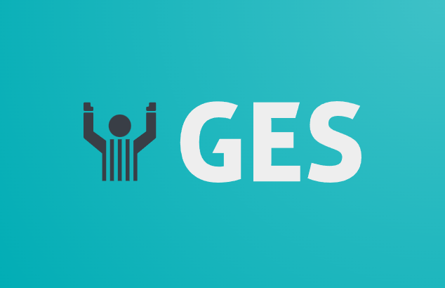
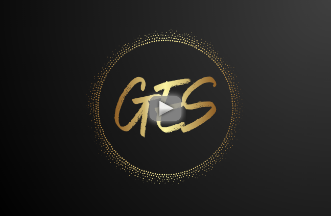

# Session Été 2023
# Gestion Équipe de sports

## Description du projet
**Nom du Produit** : Gestion Equipe Sportive

**Description** :

*Gestion Equipe Sportive est la solution ultime pour les amateurs de sport passionnés qui veulent prendre leur jeu au niveau supérieur. Que vous jouiez au football, au basket-ball, au softball ou à tout autre sport, Gestion Equipe Sportive est l'outil dont vous avez besoin pour organiser, gérer et suivre vos équipes et événements sportifs.*

**Fonctionnalités Clés** :

- **Création d'Équipe Simplifiée** : Avec Gestion Equipe Sportive, la création d'une équipe sportive n'a jamais été aussi simple. Invitez vos coéquipiers, attribuez des rôles, et commencez à planifier vos événements en quelques clics.

- **Gestion de Calendrier Intuitive** : Notre plateforme vous permet de planifier tous vos événements sportifs en un seul endroit. Ne manquez plus jamais un match ou un entraînement, et assurez-vous que tout le monde est sur la même longueur d'onde.

- **Suivi des Présences** : Oubliez les listes papier et les messages de groupe interminables. Gestion Equipe Sportive vous permet de gérer facilement les présences des membres de votre équipe pour chaque événement. 

- **Flexibilité Maximale** : Un joueur peut faire partie de plusieurs équipes, suivre plusieurs activités à venir et indiquer sa disponibilité en un seul endroit. Plus besoin de jongler entre différentes applications.

**Pour Qui ?** :

Gestion Equipe Sportive est conçu pour les amateurs de sport de tous âges et de tous niveaux. Que vous soyez un parent qui gère l'équipe de soccer de votre enfant, un joueur actif dans plusieurs équipes, ou un entraîneur cherchant à simplifier la logistique, Gestion Equipe Sportive est l'outil qui vous rendra la vie plus facile.

Ne laissez pas la gestion de votre équipe ou de vos événements sportifs devenir un casse-tête. Optez pour Gestion Equipe Sportive, l'outil complet qui vous permet de vous concentrer sur ce que vous aimez le plus : jouer au sport que vous adorez.

Simplifiez la gestion de votre équipe et restez connecté avec Gestion Equipe Sportive. Rejoignez notre communauté sportive dès aujourd'hui !

## Programmeurs
- [Jonathan Audet - GitHub](https://github.com/robaxx49) 
- [Jonathan Audet - Azure](https://azure.dev.com/1262695@csfoy.ca)
- [Dylan Côté - GitHub](https://github.com/dycote09) 
- [Dylan Côté - Azure](https://azure.dev.com/2092367@csfoy.ca)
- [Jean-Christophe Couture - GitHub](https://github.com/coujean99) 
- [Jean-Christophe Couture - Azure](https://azure.dev.com/2291719@csfoy.ca)
- [Guillaume Bérubé - GitHub](https://github.com/BarluGaming) 
- [Guillaume Bérubé - Azure](https://azure.dev.com/2194955@csfoy.ca)  
## Installation
- [Manuel des développeurs](file:///C:/Gestionequipesdesports/Documentation/Manuel_Developpeur.md)
## Utilisation
- [Manuel des utilisateurs](file:///C:/Gestionequipesdesports/Documentation/Manuel_Utilisateur.md)
## Démonstrations vidéos 
### Inscription

### Connexion

### Creation d'équipe

### Ajout Joueur

### Ajout Évenement

### AjoutIcal

### Lien Evenement

### Lien Facebook

### Gestion De Droit

### Profil

### Modifier Evenement

### Gestion de role Intra-équipe

## Contact
- Pour nous rejoindre: [DevInternationalInc@gmail.com](DevInternationalInc@gmail.com)
----------------------------------------------------------------------------------------------------------------------------------------------------------------------------------------------------------------------------------------

# Summer 2023 Session
# GES

## Project Description
**Product Name**: GES

**Description**:

*GES is the ultimate solution for passionate sports enthusiasts who want to take their game to the next level. Whether you're playing football, basketball, softball, or any other sport, GES is the tool you need to organize, manage, and track your sports teams and events.*

**Key Features**:

- **Simplified Team Creation**: With GES, creating a sports team has never been easier. Invite your teammates, assign roles, and start planning your events with just a few clicks.

- **Intuitive Calendar Management**: Our platform allows you to schedule all your sports events in one place. Never miss a game or practice again, and ensure everyone is on the same page.

- **Attendance Tracking**: Forget about paper lists and endless group messages. GES makes it easy to manage the attendance of team members for each event.

- **Maximum Flexibility**: A player can be a part of multiple teams, track multiple upcoming activities, and indicate their availability in one place. No need to juggle between different apps.

**For Whom?**:

GES is designed for sports enthusiasts of all ages and skill levels. Whether you're a parent managing your child's soccer team, an active player in multiple teams, or a coach looking to streamline logistics, GES is the tool that will make your life easier.

Don't let the management of your team or sports events become a headache. Choose GES, the comprehensive tool that allows you to focus on what you love most: playing the sport you're passionate about.

Simplify team management and stay connected with GES. Join our sports community today!

## Programmers
- [Jonathan Audet - GitHub](https://github.com/robaxx49) 
- [Jonathan Audet - Azure](https://azure.dev.com/1262695@csfoy.ca)
- [Dylan Côté - GitHub](https://github.com/dycote09) 
- [Dylan Côté - Azure](https://azure.dev.com/2092367@csfoy.ca)
- [Jean-Christophe Couture - GitHub](https://github.com/coujean99) 
- [Jean-Christophe Couture - Azure](https://azure.dev.com/2291719@csfoy.ca)
- [Guillaume Bérubé - GitHub](https://github.com/BarluGaming) 
- [Guillaume Bérubé - Azure](https://azure.dev.com/2194955@csfoy.ca)  

## Installation
- [Developer's Manual](file:///C:/Gestionequipesdesports/Documentation/Manuel_Developpeur.md)

## Usage
- [User's Manual](file:///C:/Gestionequipesdesports/Documentation/Manuel_Utilisateur.md)

## Video Demonstrations 
### Registration

### Login

### Team Creation

### Adding Players

### Adding Events

### Adding iCal

### Event Link

### Facebook Link

### Rights Management

### Profile

### Editing Event

### Intra-Team Role Management

## Contact
- To reach us: [DevInternationalInc@gmail.com](DevInternationalInc@gmail.com)

----------------------------------------------------------------------------------------------------------------------------------------------------------------------------------------------------------------------------------------
# Programmeur Hivers 2023
1.	Jonathan Audet  -   1262695  
2.	Kevin Carufel   -   1962910       
3.	Oleksi Kandratiev   -   2095166
4.	Amadou Habil Ndiamoun Njikatoufon   -   2095142

# Introduction 
TODO: Give a short introduction of your project. Let this section explain the objectives or the motivation behind this project. 

# Getting Started
TODO: Guide users through getting your code up and running on their own system. In this section you can talk about:
1.	Installation process
2.	Software dependencies
3.	Latest releases
4.	API references

# Build and Test
TODO: Describe and show how to build your code and run the tests. 

# Contribute
TODO: Explain how other users and developers can contribute to make your code better. 

If you want to learn more about creating good readme files then refer the following [guidelines](https://docs.microsoft.com/en-us/azure/devops/repos/git/create-a-readme?view=azure-devops). You can also seek inspiration from the below readme files:
- [ASP.NET Core](https://github.com/aspnet/Home)
- [Visual Studio Code](https://github.com/Microsoft/vscode)
- [Chakra Core](https://github.com/Microsoft/ChakraCore)